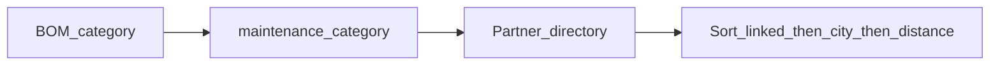
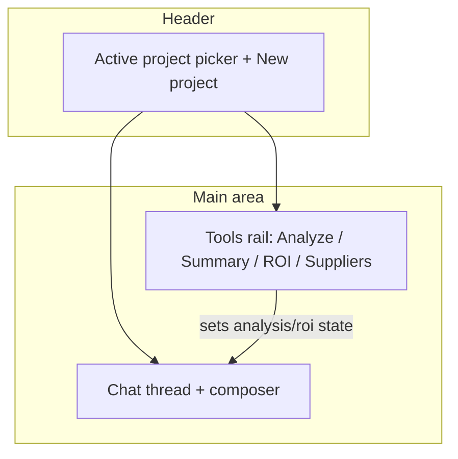

# Adaptation Studio: chat-first UX

## Problems today

- **Flow is fragmented**: [adaptation-tab.tsx](frontend/src/components/dashboard/adaptation-tab.tsx) stacks (1) create project, (2) assistant, (3) project list. “Last analysis” and ROI only appear after **Analyze** on a row in card 3, while the assistant uses a **separate** project dropdown in card 2—so users juggle two mental models.
- **Not really “chat”**: History is a short scroll area; the **structured block** (phases, costs, communication) is a separate panel **below** the composer, so the last “answer” feels split in two.
- **Global `msg`** on the top card mixes errors/disclaimers with “create project,” which reads unrelated.
- **Copy** still leans pool/examples in places; you want **any adaptation type** (bath, kitchen, terrace, pool, etc.) without implying pool is special in the UI.

Backend/API: **mostly unchanged** for chat layout; **small optional extension** for supplier clarity (see below). No streaming required for this iteration.

## Persistence: what is stored today vs chat

**Today (as implemented):**

- **Assistant “chat” is not persisted.** The thread lives only in React state (`assistantHistory` in [adaptation-tab.tsx](frontend/src/components/dashboard/adaptation-tab.tsx)). Refreshing the page, switching away from the tab, or clearing chat **loses** the conversation. The API accepts `history` on each request only to provide **short-term context** for that call; the server does not save it ([assistant_turn](app/services/adaptation_service.py) is stateless aside from reading the project/proposal).
- **These are persisted** (PostgreSQL): `AdaptationProject` (title, brief, tags, `assumptions_json` with BOM lines after Analyze), `AdaptationAsset` (photo URLs), `AdaptationProposal` (vision + BOM + totals per analyze run). That supports **re-running Analyze** and seeing **versioned proposals**, but **not** multi-turn assistant logs.

**If you want future reiteration on the same chat:**

- **Lightweight (no migration):** store a capped JSON array of `{role, content}` under e.g. `assumptions_json.adaptation_assistant_thread` via PATCH merge (same mechanism as project documentation notes)—simple but mixes concerns with BOM.
- **Proper:** new table e.g. `adaptation_assistant_messages` (`project_id`, `role`, `content`, `created_at`, optional `structured_snapshot`) or a single `conversation_json` column on `adaptation_projects`; load thread when opening the project; optional retention limit.

The plan todo `chat-persistence-optional` tracks this as a **follow-on** unless you want it in the first implementation batch.

## Documentation (product + per-project)

- **Help / documentation panel** (collapsible section, modal, or “?” entry in the Tools rail): short, skimmable sections:
  - What Adaptation studio is (indicative planning, not quotes or legal/structural advice).
  - **Workflow**: create/select project → optional photo URLs → **Analyze (AI)** for BOM bands → **Assistant** for sequencing / communication → **ROI** after setting ADR/occupancy → **Suggest suppliers** from BOM categories.
  - **Glossary**: BOM line, proposal version, maintenance category mapping (tiles → structure, plumbing → plumbing, etc.).
- **Per-project documentation**: a “Project notes” or “Documentation” textarea in the Tools rail for the active project. [AdaptationProjectPatch](app/api/v1/adaptation.py) today **does not** include `assumptions_json`—extend patch + [AdaptationProjectService.update_project](app/services/adaptation_service.py) to accept optional `assumptions_json` **merge** (shallow: `{ **existing, **incoming }`) or add a dedicated optional `documentation_notes: str` field on patch that the service writes to e.g. `assumptions_json["project_documentation"]` so BOM keys from Analyze are preserved.

## Suppliers: what they are and how location works

Today, **Suggest suppliers** calls [AdaptationAIService.suggest_suppliers](app/services/adaptation_service.py) → [MaintenanceService.fetch_partner_candidates](app/services/maintenance_service.py): active **Partner** records filtered by **trade category** (derived from BOM category), then sorted by **(1)** host-linked partners first, **(2)** same city as host, **(3)** **haversine distance km** when **both** host and partner have `latitude`/`longitude`; otherwise `distance_km` is **null** (not “far”—**unknown**).

**UX to add**:

- Static copy next to supplier results: explain that listings come from the **platform partner directory**, not a guarantee of availability; ranking prefers **your saved partners**, then **same city**, then **nearest** when coordinates exist on **both** sides.
- When **any** result has `distance_km == null`, show a single line: *“Distance not shown for some rows—add GPS to your host profile and ensure partners have coordinates for vicinity ordering.”*
- Optional **API enrichment** (recommended): extend `POST .../suggest-suppliers` response with e.g. `discovery: { host_has_coordinates: bool, sort_explanation: string }` so the UI can show precise state without duplicating business rules in the frontend.

## Target experience

- **Single source of truth**: `activeProjectId` (rename/sync from today’s `assistantProjectId` + `selected`) so assistant, analyze, ROI, and suppliers always refer to the same project.
- **Chat as primary**: Taller thread (e.g. `min-h-[320px] max-h-[55vh]`), auto-scroll to bottom on new messages, **Enter to send** (Shift+Enter newline), sticky composer, subtle **user vs assistant** bubbles (alignment + background) so it reads like a conversation.
- **One combined assistant turn**: After each reply, render **structured fields inside the assistant message** (e.g. collapsible **“Details: phases · costs · timeline · communication”** using `
` or a small disclosure) instead of a duplicate panel under the form. Keep **follow-up chips** inside that assistant turn.
- **Tools rail** (right on `md+`, below on small screens): For `activeProjectId` only—buttons **Analyze (AI)**, **ROI**, **Help** (docs), **Project notes**, **Suggest suppliers** (with category + the supplier explanation copy above)—plus the **readable analysis panel** you already built (not raw JSON). This removes “why is my analysis at the bottom?” confusion.
- **New project**: Collapsible section or a compact row (“+ New project”) at the top so it does not compete with chat.
- **Empty states**: When no project is selected, chat shows a short **assistant welcome** (static markdown) explaining: pick/create a project → optional analyze → ask anything about sequencing, costs, contractors.
- **Copy pass**: Replace pool-specific assistant/Projects descriptions with neutral language (“renovation or adaptation—kitchen, bath, outdoor, pool, …”). Keep pool only as one example in hints if needed.

## Implementation notes

- **Refactor** [adaptation-tab.tsx](frontend/src/components/dashboard/adaptation-tab.tsx) only, or extract `AdaptationChatPanel` + `AdaptationProjectTools` into colocated files under `frontend/src/components/dashboard/adaptation/` if the file exceeds ~400 lines (optional, for readability).
- **useEffect**: When `projects` loads and `activeProjectId` is empty but `projects.length === 1`, auto-select that project (optional QoL).
- **useRef**: Scroll container ref for chat end.
- **Accessibility**: Label the composer; ensure collapsible details have clear titles.

---

## Coding agent playbook (tasks, order, expectations)

Use this section to **close work with clear expectations**. Mark workspace todos as **in_progress** while working and **completed** when the **Definition of done** for that task is satisfied.

### Global rules (all agents)

1. **Do not edit this plan file** unless the user explicitly asks to change the plan.
2. **Scope**: Touch only files needed for the task; no unrelated refactors or new markdown docs unless required for DoD.
3. **Read before write**: Open existing [adaptation-tab.tsx](frontend/src/components/dashboard/adaptation-tab.tsx), [adaptation.py](app/api/v1/adaptation.py), [adaptation_service.py](app/services/adaptation_service.py); match naming, hooks, and API patterns in the repo.
4. **API client**: If backend response bodies change, update [frontend/src/lib/api.ts](frontend/src/lib/api.ts) `adaptationApi` types.
5. **Tests**: Add or extend tests under `/tests` for API-critical behavior (e.g. PATCH merge for project notes). Pure layout may rely on manual check unless trivial unit coverage is free.
6. **When a task is done**: Confirm every bullet in that task’s **Definition of done**; run `pytest` on affected tests and lint on touched frontend files if the repo uses them.
7. **chat-persistence-optional**: **Do not implement** unless the user explicitly adds it to the current sprint; leave the todo **pending** or **cancelled** with a short note.

### Recommended task order (dependencies)

| Order | Todo id                      | Depends on    | Notes                                                       |
| ----- | ---------------------------- | ------------- | ----------------------------------------------------------- |
| 1     | `unify-active-project`       | —             | Single `activeProjectId` unlocks the rest                   |
| 2     | `tools-rail`                 | 1             | Layout shell for Analyze / ROI / suppliers / analysis panel |
| 3     | `chat-layout`                | 1             | Chat UX                                                     |
| 4     | `merge-structured-into-turn` | 3             | Structured blocks inside assistant bubble                   |
| 5     | `copy-neutral`               | 2–4           | After structure is stable                                   |
| 6     | `help-docs-panel`            | 2             | Lives in Tools rail or dialog                               |
| 7     | `project-notes`              | 1 (+ backend) | Extend PATCH / service merge first                          |
| 8     | `supplier-discovery-ux`      | 2             | UI copy + optional API `discovery`                          |
| —     | `chat-persistence-optional`  | User call     | Defer by default                                            |

### Per-task instructions and Definition of done

#### `unify-active-project`

- **Goal**: One `activeProjectId` drives assistant API calls, Analyze, ROI, supplier search, and which project’s analysis/ROI UI is shown.
- **Files**: [adaptation-tab.tsx](frontend/src/components/dashboard/adaptation-tab.tsx) (primary).
- **Steps**: (1) Replace dual `assistantProjectId` + `selected` with one state; (2) Analyze/ROI actions set active project when invoked from a list row; (3) On project switch, either clear `analysis`/`roi`/`supplierHits` or key them by `projectId`—choose one behavior and add a one-line code comment.
- **Definition of done**: Cannot have assistant on project A while analysis panel reflects project B.
- **Out of scope**: Chat persistence.

#### `tools-rail`

- **Goal**: Responsive Tools area (`md+`: beside chat; small screens: below) with Analyze, readable analysis block, ROI inputs, photo URL, suppliers—all for `activeProjectId`.
- **Files**: [adaptation-tab.tsx](frontend/src/components/dashboard/adaptation-tab.tsx); optional split files under `frontend/src/components/dashboard/adaptation/`.
- **Steps**: Grid/flex two-column layout; move controls out of the long bottom “project card” into Tools; keep project list minimal (select active + title) if redundant.
- **Definition of done**: User completes a full loop (analyze → see summary → ROI → suppliers) without hunting below unrelated create-project UI.
- **Out of scope**: New microservices.

#### `chat-layout`

- **Goal**: Chat-like thread: taller viewport, bubbles, auto-scroll to latest, **Enter** = send, **Shift+Enter** = newline, welcome copy when no project selected.
- **Files**: [adaptation-tab.tsx](frontend/src/components/dashboard/adaptation-tab.tsx).
- **Steps**: `useRef` + scroll after append; `onKeyDown` on composer; min/max height on scroll container; static welcome markdown.
- **Definition of done**: Multi-turn thread stays readable; keyboard behavior matches spec; empty state explains next step.
- **Out of scope**: SSE/streaming.

#### `merge-structured-into-turn`

- **Goal**: Phases, costs, timeline, communication, follow-up chips render **inside** the assistant message (e.g. `
`), not a second panel under the whole chat.
- **Files**: [adaptation-tab.tsx](frontend/src/components/dashboard/adaptation-tab.tsx).
- **Steps**: Attach structured payload to the last assistant message in state **or** render one composite bubble per response; remove duplicate `assistantStructured` slab below composer unless needed as a11y fallback only.
- **Definition of done**: One assistant “card” per reply; no large duplicate structured section below the input.
- **Out of scope**: Backend schema changes.

#### `copy-neutral`

- **Goal**: UI copy describes **any** adaptation (kitchen, bath, outdoor, pool as one example), not pool-first.
- **Files**: [adaptation-tab.tsx](frontend/src/components/dashboard/adaptation-tab.tsx).
- **Steps**: Rewrite CardDescription/help strings; relocate global `msg` to composer-adjacent error, toast, or chat “system” line.
- **Definition of done**: New user does not infer “pools only.”
- **Out of scope**: Rewriting all server log strings.

#### `help-docs-panel`

- **Goal**: In-app Help: what studio is, disclaimers, step workflow, glossary (BOM, proposal, category mapping).
- **Files**: [adaptation-tab.tsx](frontend/src/components/dashboard/adaptation-tab.tsx) or small `AdaptationHelpPanel.tsx`.
- **Steps**: Trigger from Tools (button or `?`); static JSX or markdown.
- **Definition of done**: Help opens without navigation away; covers workflow + glossary.
- **Out of scope**: Full i18n.

#### `project-notes`

- **Goal**: Persist per-project documentation text without deleting `assumptions_json.bom_lines` from Analyze.
- **Files**: [app/api/v1/adaptation.py](app/api/v1/adaptation.py), [app/services/adaptation_service.py](app/services/adaptation_service.py), [adaptation-tab.tsx](frontend/src/components/dashboard/adaptation-tab.tsx), [api.ts](frontend/src/lib/api.ts).
- **Steps**: Extend `AdaptationProjectPatch` with `documentation_notes` **or** shallow-merge `assumptions_json` in `update_project` preserving existing keys; wire Save or debounced save from Tools.
- **Definition of done**: After save + refresh, notes reload; BOM from Analyze still intact.
- **Tests**: Pytest PATCH notes-only preserves `bom_lines` in `assumptions_json` when present.

#### `supplier-discovery-ux`

- **Goal**: Explain partners = directory listings; order = linked → same city → distance when both have GPS; null km = unknown not infinite distance.
- **Files**: [adaptation-tab.tsx](frontend/src/components/dashboard/adaptation-tab.tsx); optionally [adaptation_service.py](app/services/adaptation_service.py) return value for `suggest_suppliers`.
- **Steps**: Paragraph above results; GPS hint when any `distance_km` is null; optional `discovery: { host_has_coordinates, sort_explanation }`.
- **Definition of done**: Non-technical user understands listing source and ranking.
- **Tests**: Optional pytest if `discovery` added.

#### `chat-persistence-optional` (defer)

- **Goal**: Restore assistant thread after reload (cap length).
- **Agent instruction**: **Skip** unless user explicitly prioritizes; do not block other todos on this.

### Milestone verification checklist

- [ ] Single active project across chat + tools.
- [ ] Chat UX + Enter/Shift+Enter + auto-scroll + welcome.
- [ ] Structured details inside assistant turn only.
- [ ] Tools rail: Analyze, analysis readout, ROI, photos, suppliers, Help, project notes.
- [ ] Neutral adaptation copy.
- [ ] Help panel complete.
- [ ] Project notes persist without clobbering BOM.
- [ ] Supplier explainer (+ optional `discovery`).
- [ ] Pytest (targeted) + frontend lint on touched files.
- [ ] Manual: host dashboard Adaptation tab, happy path, no console errors.

