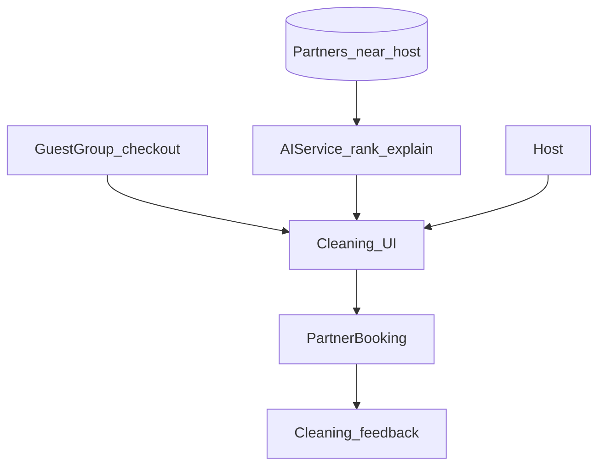

# Host cleaning services (updated)

## Do we already have AI, fees, calendar, feedback?

**No — not as a shipped cleaning feature today.**

| Area | Current codebase / prior MVP plan | Gap |
|------|-----------------------------------|-----|
| **AI seeking cleaning options** | Recommendations AI targets **attractions/guests**, not cleaners. Guest message AI is placeholder text. | Need a **cleaning-specific discovery** path (see below). |
| **Clear communication process** | Prior MVP = **mailto / tel / WhatsApp** + copy template only. | Add explicit **steps** + optional **AI draft** + **host approval** before send. |
| **Fees** | `Partner` has `price_range`, `commission_rate`; no cleaning rate card. | Expose structured **fee hints** + strong **“confirm with provider”** copy. |
| **Dates / calendar** | `GuestGroup.check_out_date` exists; `PartnerBooking.service_date` exists but not wired for turnover cleans in UI. | **List upcoming check-outs** + attach **requested clean date** to a booking or request object. |
| **Feedback** | `Partner.average_rating` / `total_reviews` exist at partner level; no **per-job host feedback** flow for cleaning. | Add **job-scoped** rating/notes after marked complete. |

Reusable pattern already written in [host_maintenance_planning_d6f16a77.plan.md](host_maintenance_planning_d6f16a77.plan.md): **deterministic candidates from DB → AI rank & explain** (LLM must not invent businesses). Apply the same pipeline with filters for **cleaning/turnover** partners.

---

## Scope (phased)

### Phase 1 — Foundation (still valuable without AI)

- Partner rows for cleaners; host links via `HostPartner`.
- Auth-scoped APIs with **contact** only for logged-in host.
- Dashboard: browse / my cleaners, **fee hints** (`price_range` + optional `rate_card` JSON), **upcoming check-outs** list from guest groups, **prefilled message** + copy / deep links.

### Phase 2 — AI + structured comms + calendar + feedback

1. **AI discovery**  
   - Query: city / radius / `partner_type` or category = cleaning.  
   - Optional: `AIService` structured output — ordered `partner_id`s + one-line **why** each.  
   - Guardrails: disclaimer, rate limit, log model id; candidates empty → generic advice only.

2. **Communication process** (clear to the host)  
   - Steps: *Choose cleaner* → *Pick date (from calendar or manual)* → *Review/edit message* → *Send via channel* (copy-first; email/SMS later if integrated).  
   - Optional: store **draft + final** snippet and timestamp for support (minimal table or `booking_details`).

3. **Fees**  
   - Display `price_range` + optional `rate_card` (e.g. `{ "studio": 45, "one_bed": 60, "currency": "EUR" }` — all **indicative**).  
   - If platform commission applies, show **transparent** line; host still confirms with cleaner.

4. **Dates / calendar**  
   - Primary: **sync to `GuestGroup.check_out_date`** (and check-in for “before arrival” deep clean).  
   - Persist intent: `PartnerBooking` with `service_date`, `booking_details` JSON (`turnover`, `guest_group_id`, `notes`), status workflow `pending → confirmed → completed`.

5. **Feedback**  
   - After `completed`: host submits **1–5 stars + short comment** tied to that booking (or lightweight `cleaning_feedback` table with `host_id`, `partner_id`, `partner_booking_id`).  
   - Roll up to partner-level stats periodically or on write.

---

## Key files to touch (when implementing)

- Backend: [`app/models/partner.py`](app/models/partner.py), [`app/api/v1/partners.py`](app/api/v1/partners.py), new `cleaning.py` router or namespaced routes under partners; [`app/services/ai_service.py`](app/services/ai_service.py) + small `cleaning_discovery_service.py`.
- Frontend: [`frontend/src/lib/api.ts`](frontend/src/lib/api.ts), [`frontend/src/components/dashboard/host-dashboard.tsx`](frontend/src/components/dashboard/host-dashboard.tsx) or dedicated cleaning widget.
- Tests: [`tests/`](tests/) — auth, empty candidate list, structured LLM mock, feedback permissions.

---

## Diagram (AI + booking + feedback)

---

## Relation to maintenance plan

Turnover cleaning overlaps **maintenance category “Cleaning / turnover”** in [host_maintenance_planning_d6f16a77.plan.md](host_maintenance_planning_d6f16a77.plan.md). Prefer **one shared “service partner discovery” helper** (category filter differs: `cleaning` vs `plumber`) so AI ranking and guardrails stay consistent.
