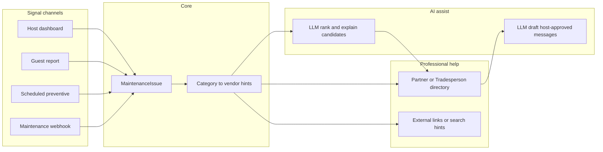
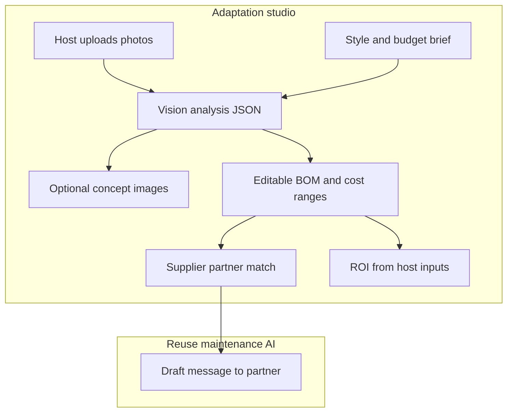

# Maintenance planning for property hosts (Iznajmljivači)

## Context and interpretation

**Iznajmljivači** here means **people who rent out** accommodation (your existing `[Host](c:\Apps\TouristGuideLocal\app\models\host.py)` / `[HostProfile](c:\Apps\TouristGuideLocal\app\models\host.py)` model), not long-term tenants. The same product ideas apply: things break, guests notice first, and you need **signals**, **tasks**, and **who to call**.

Existing assets to build on:

- **Properties**: Today one host maps loosely to one primary location in `Host` + optional `HostProfile` (`property_name`, `amenities`, `address`, coords). There is **no multi-property** table yet; the plan should either scope to **one property per host (MVP)** or introduce `**Property`** early if you need several units under one account.
- **Partners**: `[Partner](c:\Apps\TouristGuideLocal\app\models\partner.py)` + `PartnerType.SERVICE` and `HostPartner` can represent **majstori / agencies** once you add a maintenance-oriented subtype or category (or a dedicated `Tradesperson` table if you want to avoid overloading guest-experience partners).
- **Channels**: `[channel_webhooks](c:\Apps\TouristGuideLocal\app\api\v1\channel_webhooks.py)` (e.g. Booking.com) shows the pattern for **verified inbound webhooks**; reuse for maintenance-related events where APIs allow.
- **Dashboard**: `[host-dashboard.tsx](c:\Apps\TouristGuideLocal\frontend\src\components\dashboard\host-dashboard.tsx)` / `[host-dashboard-main-content.tsx](c:\Apps\TouristGuideLocal\frontend\src\components\dashboard\widgets\host-dashboard-main-content.tsx)` — add a **Maintenance** tab and an **Adaptation** (or **Redesign**) area alongside Stay, Channels, Guests, etc.
- **Guests**: `[GuestDashboard](c:\Apps\TouristGuideLocal\frontend\src\components\guest\GuestDashboard.tsx)` exists — a natural **“report issue”** channel for reactive maintenance.
- **AI stack**: `[AIService](c:\Apps\TouristGuideLocal\app\services\ai_service.py)` / fallback and structured flows (e.g. `[itinerary_service.py](c:\Apps\TouristGuideLocal\app\services\itinerary_service.py)` `generate_structured_response`) — reuse for **partner discovery**, **message drafting**, **vision/description of spaces**, **BOM/cost line items**, and **ROI narrative**; add or wire a **vision + image generation** capability where product keys allow (may be a second provider endpoint).

**Note:** `[HostNotification](c:\Apps\TouristGuideLocal\app\models\content_source.py)` is **tied to `content_update_id`** (content scraper). Do **not** overload it for maintenance; use a dedicated `**MaintenanceIssue`** (or similar) model and optional separate **outbound notification** records if you email/SMS later.

---

## What typically needs maintenance (rental inventory)

Group into **categories** (stable enums for UI, filters, and vendor matching):

| Area                     | Examples                                      |
| ------------------------ | --------------------------------------------- |
| **HVAC / climate**       | AC split, heating, filters, dehumidifier      |
| **Plumbing**             | Leaks, boiler, drains, toilet, water heater   |
| **Electrical**           | Breakers, lighting, outlets, outdoor lighting |
| **Appliances**           | Fridge, dishwasher, washer, coffee machine    |
| **Structure / envelope** | Roof, gutters, windows, doors, locks          |
| **Exterior**             | Pool, garden, irrigation, facade              |
| **Safety**               | Smoke/CO detectors, fire extinguisher, gas    |
| **Cleaning / turnover**  | Deep clean, linen, pest signs                 |
| **Connectivity**         | Wi‑Fi, smart lock batteries                   |

Each item can be:

- **Reactive** (something failed or a guest reported it)
- **Preventive** (calendar or meter-based: AC service, chimney, legionella where relevant, filter changes)

---

## How you learn that something needs maintenance (signal channels)

Design a **single internal model** (e.g. `MaintenanceSignal` or fields on `MaintenanceIssue`: `source`, `source_ref`, `raw_payload`) so every channel writes the same way.

**Phase 1 (high value, low integration risk)**

1. **Host dashboard** — manual create/edit issue, photos, priority, link to amenity/category.
2. **Guest “Report a problem”** — simple form on guest UI, creates issue linked to `guest_group_id`, optional photo; host sees it in Maintenance tab.
3. **Preventive schedules** — host-defined rules: e.g. “AC filter — every 180 days”, “Boiler inspection — yearly”; background job creates **due** tasks.

**Phase 2 (automation / integrations)**

1. **Generic maintenance webhook** — authenticated POST (HMAC like `[channel_webhooks](c:\Apps\TouristGuideLocal\app\api\v1\channel_webhooks.py)`) for future PMS, Zapier, or custom scripts.
2. **Email ingest** (optional) — dedicated address + parser for “forwarded handyman emails” (higher complexity; defer unless needed).
3. **OTA message hints** (later) — parse Booking/Airbnb messages for keywords; needs careful privacy/consent and rate limits; treat as **suggested draft** for host approval, not auto-ticket by default.

---

## Where to seek help (majstori, servisi)

**Data model options** (pick one for MVP):

- **A — Extend `Partner`**: Add `partner_type` value e.g. `trades` / `maintenance` and fields like `trade_categories[]`, `service_radius_km`, `emergency_available`. Reuse `HostPartner` for “my plumber”.
- **B — Separate `MaintenanceVendor` table**: Clearer if guest-facing partners must stay curated separately.

**UX for the host**

- On each issue: **suggested contacts** = host’s saved vendors for that **category** + **city/region**, sorted by distance if coords exist.
- **Fallback content**: static HR-focused hints (e.g. “vodoinstalater — traži licencu / preporuku”) and optional **deep links** to directories (you stay neutral; no scraping without legal review).

**Automation**

- When issue is created with category X, auto-attach **playbook** text: typical checks, when to call emergency services vs. handyman, and **pre-filled message template** (Croatian) to SMS/WhatsApp if you add click-to-copy.

---

## AI: find partners in the area (majstori)

**Goal:** Given a maintenance issue (category, location, urgency), return a **short ranked list** of who to contact — combining **your data** with optional **AI reasoning**, not replacing legal verification of businesses.

**Pipeline (recommended)**

1. **Deterministic candidate set** — Query `Partner` (and/or `HostPartner`) filtered by:
  - `trade_categories` / `partner_type` matching issue category
  - same **city / county / radius km** from host or property coordinates (reuse distance patterns used elsewhere for attractions/hosts)
2. **AI rank & explain** — Pass compact JSON of candidates (name, categories, city, distance, phone, notes) plus issue summary into the LLM via `AIService` (structured output schema: ordered `partner_id`s + one-line **why** per row). Keeps hallucination risk low: model only reorders/explains **existing rows**, does not invent contacts.
3. **Optional enrichment (phase 2)** — If the DB list is empty or thin:
  - **Web search tool** path (if enabled in your AI config, similar to `use_web_search` in `AIService`) to suggest **types** of queries or **generic** local resources, still framed as “verify before hiring”; or
  - **Google Places / Maps API** (if you add a key) for “vodoinstalater near {lat,lng}” and map results into **ephemeral suggestions** (not auto-inserted as verified `Partner` rows unless host confirms).

**Guardrails**

- Disclaimers in UI: AI suggestions are **assistive**; host confirms accuracy and licensing.
- Log prompt hashes / model id for support, not full PII if avoidable.
- Rate-limit discovery endpoint per host.

---

## AI: communication with partners (majstori)

**Goal:** Reduce friction from “I need a plumber” to a **polite, complete first message** the host can send — without the platform impersonating the host without consent.

**Flows**

1. **Draft outbound message** — Input: issue fields, chosen partner, tone (formal/informal HR), channel hint (SMS / WhatsApp / email). LLM produces **Croatian** text: greeting, property location (city + area, not full guest personal data unless host opts in), problem summary, urgency, availability question, contact callback.
2. **Host in the loop** — UI shows **editable** draft; actions: **Copy**, **Open WhatsApp/SMS** with `mailto:` / `sms:` / `https://wa.me/...` prefilled where possible; optional **Send email** later if you integrate SMTP/SendGrid.
3. **Thread assist (optional)** — Paste partner reply; AI suggests **short reply options** (clarify scope, ask for quote, propose time window). Still **host approves** before sending.

**Persistence**

- Store `maintenance_outreach_drafts` or embed in `maintenance_issue_events`: `partner_id`, `channel`, `draft_text`, `final_sent_text` (if tracked), `created_at`, `host_edited` flag — useful for audits and tests.

**Compliance / trust**

- Never auto-send on behalf of host without explicit **“Send”** and configured provider.
- For guest-reported issues, **anonymize** guest identity in default drafts unless host toggles “include guest contact”.

---

## Adaptation studio: redesign from photos, suppliers, costs, ROI

**Goal:** Host uploads **current-state images** (room, facade, bath, kitchen), describes intent (style, budget band, constraints), and gets a **structured project package**: conceptual “after” visuals, **supplier/partner angles**, **indicative cost build-up**, and a **simple ROI story** — always labeled **non-binding** (not a quote, not legal/building advice).

### User flow

1. **Create adaptation project** — Title, room/scope type, optional link to `property_id`, style keywords (e.g. “Scandi”, “Istrian stone”), budget band (low / mid / high), timeline notes.
2. **Upload images** — One or more photos; store in object storage or existing media pattern; record EXIF-free metadata (dimensions optional).
3. **AI vision pass** — Multimodal model describes layout, visible finishes, obvious constraints (small bath, sloped ceiling). Output: structured JSON (room type guess, materials seen, risks: “likely load-bearing wall — verify with engineer”). **No permit/engineering decisions** — copy tells host to verify locally.
4. **Concept / “imagine” visuals** — Optional step: image-to-image or text+image generation for **inspiration only** (watermark or banner: “AI concept — not construction documentation”). If the stack has no image API yet, ship **textual mood board** + palette + furniture style first, add generation in a follow-up.
5. **Scope & BOM (structured)** — LLM proposes **line items**: demolition/finish/carpentry/electrical/plumbing/fixtures/furniture, each with **quantity hints**, **unit**, **HR market rough band** (min/mid/max EUR) from model priors. Host **edits every number**; server stores assumptions JSON (e.g. “€/m² floor tile mid”) for reproducibility.
6. **Find suppliers & partners** — For each BOM category (tiles, lighting, joinery…), run the same **deterministic partner query + AI rank** as maintenance, optionally extended `Partner` types (`retail`, `interior`, `carpentry`). Suggest **who to RFQ**; reuse **draft-message** flow for “request quote for attached scope”.
7. **Costs** — Show **subtotal ranges** per section + **grand total range**; separate **DIY vs. contracted** toggle if useful. Never present as a firm quote; **“Indicative — get written quotes”** in UI and PDF export.
8. **ROI (transparent math)** — Host enters **baseline** inputs they already know (or from OTA stats): average nightly rate (ADR), occupancy % or nights sold/year, optional current monthly revenue. Host enters **expected uplift** (% higher rate and/or % higher occupancy) **or** a fixed “extra €/night” hypothesis. Backend computes:
   - `incremental_revenue_year = f(ADR, occupancy, uplift_assumptions)` (document exact formula in code and UI tooltip).
   - `simple_payback_months = total_investment_mid / (incremental_revenue_month)` when investment is taken from BOM mid estimate.
   - LLM generates a **short narrative** (“If occupancy rises from X to Y…”) **strictly from the same numbers** the host entered — no invented statistics.

### Data model additions (illustrative)

- `**adaptation_projects`**: `host_id`, optional `property_id`, `title`, `brief`, `style_tags`, `budget_band`, `status` (draft / active / archived), `assumptions_json`, `roi_inputs_json`, `created_at`.
- `**adaptation_assets`**: `project_id`, `storage_url`, `kind` (before_photo / concept_render / attachment), `sort_order`, optional `vision_summary_id`.
- `**adaptation_proposals`**: `project_id`, `version`, `vision_analysis_json`, `bom_json`, `concept_image_urls[]`, `total_range_min/max`, `model_ids` (audit).

### API examples

- `POST /api/v1/adaptation/projects`, `POST .../projects/{id}/assets` (upload).
- `POST .../projects/{id}/analyze` — vision + structured room/BOM draft.
- `POST .../projects/{id}/concept-images` — optional generation job (async if slow).
- `POST .../projects/{id}/suggest-suppliers` — category-keyed partner lists + rank.
- `PATCH .../projects/{id}/bom` — host-edited lines; server recomputes totals.
- `PATCH .../projects/{id}/roi` — recompute payback from stored formula.

### Frontend

- **Adaptation** tab or nested route: stepper (Photos → Brief → Analysis → Concepts → BOM & costs → Suppliers → ROI).
- Side-by-side **before** vs **concept** where images exist; export **one-page PDF summary** (optional, phase 2) with disclaimers.

### Legal / product guardrails

- Persistent disclaimer: **not** architectural, structural, or legal advice; **permits and licensed contractors** required where applicable; Croatia-specific building rules out of scope for v1.
- ROI is **hypothetical**; show sensitivity (e.g. low/mid/high uplift columns).
- Rate-limit image + vision endpoints; moderate stored images if abuse is a concern.

### Tests

- BOM JSON validates against schema; edited host numbers override model defaults in totals.
- ROI: fixture inputs → expected `incremental_revenue_year` and payback (pure function tests).
- Supplier suggestion: category maps to correct partner filter.
- Vision endpoint: mock multimodal response; ensure PII from EXIF stripped if you strip metadata.

---

## Core backend shapes (concise)

New tables (illustrative names):

- `**maintenance_issues`**: `host_id`, optional `property_id`, `guest_group_id`, `category`, `title`, `description`, `status` (open / in_progress / waiting_vendor / resolved), `priority`, `photos` (URLs or FK to media), `due_at`, `resolved_at`, `source`, `source_metadata` (JSON).
- `**maintenance_schedules`**: recurring preventive rules per host/property.
- Optional `**maintenance_issue_events`** for audit (status changes, comments).
- **Adaptation** tables: `adaptation_projects`, `adaptation_assets`, `adaptation_proposals` (see [Adaptation studio](#adaptation-studio-redesign-from-photos-suppliers-costs-roi)).

APIs under e.g. `/api/v1/maintenance/...` and `/api/v1/adaptation/...` with host auth; guest endpoint scoped by access code / group id for “report only”.

**AI-specific endpoints (examples)**

- `POST .../maintenance/issues/{id}/suggest-partners` — returns ranked partners + LLM “why” lines (candidates from DB first).
- `POST .../maintenance/issues/{id}/draft-message` — body: `partner_id`, `tone`, `channel`; returns editable Croatian draft.
- Optional `POST .../maintenance/issues/{id}/reply-suggestions` — body: pasted inbound text from majstor.

Services: `maintenance_service.py` (CRUD, scheduling, matching vendors), `maintenance_ai_service.py` or methods on existing service wrapping `AIService.generate_structured_response`, small **task** in existing Celery/cron style if you already run periodic jobs (`[crawl4ai_realtime_tasks](c:\Apps\TouristGuideLocal\app\tasks\crawl4ai_realtime_tasks.py)` shows cleanup patterns).

---

## Frontend

- New **Maintenance** tab in `[host-dashboard.tsx](c:\Apps\TouristGuideLocal\frontend\src\components\dashboard\host-dashboard.tsx)`: list/kanban, filters by status/category, detail drawer with vendor suggestions and templates.
- New **Adaptation** flow (tab or sub-route): uploads, analysis, concepts, BOM/costs, suppliers, ROI with disclaimers.
- Guest flow: one **Report issue** entry in guest shell (`[guest-interface.tsx](c:\Apps\TouristGuideLocal\frontend\src\components\guest\guest-interface.tsx)` / `GuestDashboard`) posting to API.

---

## Tests (`[tests/](c:\Apps\TouristGuideLocal\tests)`)

- Create issue from host + from guest (auth boundaries).
- Preventive rule fires due issue on mocked clock.
- Webhook HMAC verification rejects bad signature.
- Vendor suggestion returns host-linked partners for matching category.
- AI ranking: given fixed fixture partners, output order respects distance + category (mock LLM or snapshot JSON).
- AI draft: structured response contains required sections; guest PII omitted by default.
- Adaptation: ROI calculator pure functions; BOM schema validation; optional mocked vision/generation responses.

---

## Rollout phases

1. **MVP**: issues + categories + host UI + guest report + basic vendor list (reuse `Partner` / `trusted_partners` migration path).
2. **AI assist (near-MVP)**: rank-and-explain on DB partners + Croatian draft + copy / deep-link send; outreach event logging.
3. **Adaptation v1**: projects + photo upload + vision/BOM structured output + host-edited costs + supplier match + ROI panel (text concepts OK; image generation if keys available).
4. **Automation**: schedules + daily job + email/push to host (if you add outbound notifications).
5. **Integrations**: maintenance webhook; Places or web-enriched suggestions when DB empty; later OTA/message assist behind human approval; optional real email/SMS providers; PDF export and async concept jobs when stable.

---

## Open product decision (affects schema)

- **Single property vs. multi-property per host**: If hosts manage several apartments, add `**Property`** (FK from issues and schedules) early; otherwise attach everything to `host_id` only for a faster MVP.

