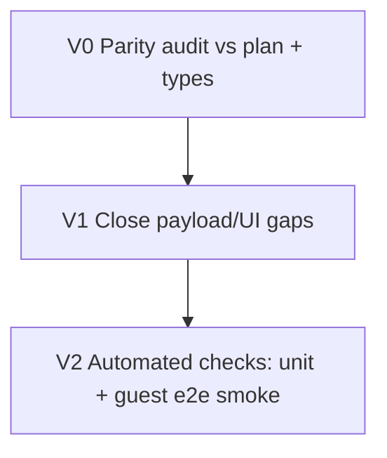

# Guest UX/UI overhaul — iterative agent plan

This document complements the Cursor plan **Guest UX/UI Overhaul** (`guest_ux_ui_overhaul_20625255.plan.md`). Use it to delegate work to **parent** and **subagents** with clear verification and handoffs.

## Baseline: is the original plan implemented?

**Yes — the scoped items in that plan are implemented in this repo**, including:

| Plan item | Evidence (verify in tree) |
|-----------|---------------------------|
| Host info on Welcome | `guest-interface.tsx` loads `guestGroupsApi.getHostOfferings`, Welcome tab uses `welcome_message`, tips, specialties, `location_story` |
| Attraction detail sheet | `frontend/src/components/guest/AttractionDetailSheet.tsx` + wiring in `guest-interface.tsx` |
| Images on cards | `featured_image_url` on recommendation cards + `SnapScrollRow` |
| Leaflet map | `GuestMap.tsx`, `react-leaflet` in `package.json`, dynamic import in `guest-interface.tsx` |
| Rich itinerary + vote/check-in | `itinerariesApi.voteActivity` / `checkInActivity` with `accessCode` in `guest-interface.tsx` |
| Recommendation feedback | `recommendationsApi.provideFeedback` + thumbs UI + local persistence key |
| Preferences summary | `getGuestPreferences` + “Your profile” / update link on Welcome |
| Message host FAB | `GuestMessageFab` + `sendHostMessage` |
| Mobile scroll UX | `SnapScrollRow`, fade/counter pattern |
| Seasonal / stay context | Stay day chips, time-based greeting helpers in `guest-interface.tsx` |

**Residual gaps (optional follow-ups):**

- ~~`profile_extras.guest_testimonials`~~ **Done:** Welcome tab “What guests say” (up to 3), tolerant of string or object rows.
- ~~`recommendations.attractions` (host `favorite_local_spots`)~~ **Done:** Welcome “Host’s nearby favorites” with Maps links (up to 6).
- ~~**Full attraction review bodies**~~ **Done:** `AttractionDetailSheet` loads approved reviews via `GET /api/v1/attractions/{id}/reviews`.
- ~~**Embedded attractions on guest recommendations**~~ **Done:** `GuestRecommendationBatch` / history enrichment (`score`, `reason`, `attraction` card) for Discover + Map pins.

---

## Global rules (same spirit as `docs/ITERATIVE_AGENT_EXECUTION_PLAN.md`)

1. Read `AGENTS.md` and `.cursor/rules/touristguide-local-dev.mdc` before running the app (UI **3055**, API **8000**).
2. Do **not** commit unless the user explicitly asks.
3. After changes, run the **verification** for that phase; if red, fix or return logs + hypothesis.
4. Prefer small, reviewable diffs.

---

## Master dependency graph



---

## Phase V0 — Parity audit (read-only + short report)

**Goal:** Confirm runtime behavior matches the Cursor plan; list only **actionable** gaps.

**Owner:** `explore` (readonly) or parent skim.

**Tasks:**

1. Trace `loadGuestData` in `guest-interface.tsx`: parallel fetches for group, preferences, recommendations, itinerary, host-offerings.
2. Compare **Welcome**, **Recommendations**, **Itinerary**, **Map** tabs to the plan’s bullet lists.
3. Open `GuestHostOfferingsPayload` in `frontend/src/lib/api.ts` and note **fields with no UI**.

**Verification:** One-page bullet summary (can live as a PR comment or reply to parent): “implemented / partial / missing” per feature.

**Subagent handoff prompt:**

> You are Phase V0 (readonly). Read `docs/GUEST_UX_OVERHAUL_AGENT_ITERATION.md` and the Cursor plan `guest_ux_ui_overhaul_20625255.plan.md`. Audit `frontend/src/components/guest/guest-interface.tsx`, `AttractionDetailSheet.tsx`, `GuestMap.tsx`, and `frontend/src/lib/api.ts` types for guest host offerings. Return: (1) table plan-row vs status, (2) list of API fields without UI, (3) any broken imports or obvious a11y issues. Do not change code unless you find a production bug — then stop and report.

---

## Phase V1 — Close documented gaps (implementation)

**Goal:** Surface remaining host JSON on Welcome and/or detail sheet **without** redesign.

**Owner:** `generalPurpose` (frontend) or parent.

**Tasks:**

1. If API returns `guest_testimonials`: add a compact “Guests say” block on Welcome (carousel or 2–3 quotes max).
2. If API returns `favorite_local_spots` (or equivalent): add typed fields + quick links (maps search or internal deep link).
3. If backend has **GET reviews for attraction** used elsewhere: wire optional fetch into `AttractionDetailSheet` behind loading state; else document “counts only” in code comment.

**Verification:**

```bash
npm run build --prefix frontend
```

Optional manual: open `http://127.0.0.1:3055/guest/<code>` with a real access code after `npm run dev`.

**Subagent handoff prompt:**

> You are Phase V1. Implement only the gaps listed in the V0 report (start with testimonials + favorite spots if present in API JSON). Extend types in `frontend/src/lib/api.ts` if needed. Keep UI consistent with existing Tailwind/shadcn patterns. Run `npm run build --prefix frontend`. Return: diff summary + screenshot notes.

---

## Phase V2 — Tests and smoke automation

**Goal:** Prevent regressions on the guest overhaul (API wiring, feedback, map SSR boundary).

**Owner:** `generalPurpose` + `shell`.

**Tasks:**

1. Add or extend **pytest** under `tests/` for any **backend** guest endpoints touched (e.g. host-offerings shape, feedback POST) — only if gaps found in V0/V1.
2. Add **frontend** test or Playwright smoke (repo convention): e.g. mock API and assert Welcome renders `welcome_message` when host offerings payload is stubbed.
3. If using browser MCP: one pass on Welcome + Recommendations + Map tabs (see `mcps/cursor-ide-browser` instructions).

**Verification:**

```bash
python -m pytest tests/ -q --tb=short -k guest
npm run build --prefix frontend
```

(Adjust `-k` to match new test names.)

**Subagent handoff prompt:**

> You are Phase V2. Add minimal meaningful tests guarding guest host-offerings + recommendation feedback contracts. Follow `tests/conftest.py` patterns; use `.env` where tests already load it. Run the verification commands above. Do not commit unless asked. Return: new test paths + command output summary.

---

## Parent orchestration loop

1. Spawn **V0** (`explore`, readonly).
2. If “partial/missing” rows exist → spawn **V1** with the V0 artifact attached.
3. After V1 green build → spawn **V2** for tests/smoke.
4. Parent re-runs verification; if red, re-open the same phase with logs.

---

## Optional parallel track (polish)

- Lighthouse / a11y pass on guest routes (`web-perf` skill if DevTools MCP available).
- iOS Safari: Leaflet tap targets + bottom sheet scroll chaining.
