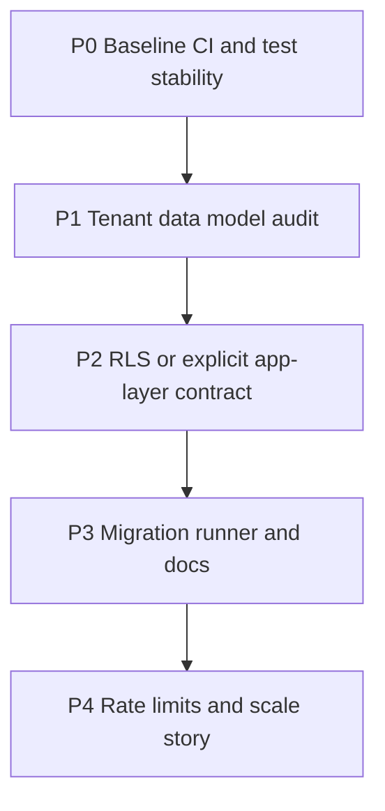

# Iterative agent execution plan — platform hardening

This document splits work into **independent phases** with clear **inputs, outputs, verification, and handoff prompts** so a parent agent can delegate to subagents, merge results, and re-run checks until done.

## Global rules for every subagent

1. Read `AGENTS.md` and `.cursor/rules/touristguide-local-dev.mdc` before running the app.
2. **Do not commit** unless the user explicitly asks; keep changes in the working tree or a branch.
3. After code changes: run the **verification commands** for that phase; if they fail, fix or document blockers in the phase log.
4. Prefer **small PR-sized commits** logically grouped if the user later requests commits.
5. Tests live under `tests/`; new tests must be meaningful (guard regressions, document contracts).

## Master dependency graph



Phases **P0** and **P1** can start in parallel only where noted; **P2** needs P1’s inventory.

---

## Phase P0 — CI gate + flaky test elimination (priority: unblock everyone)

**Goal:** A green, reproducible CI job that matches how tests are designed (SQLite in-memory via `tests/conftest.py`).

**Owner subagent type:** `shell` + `generalPurpose` (small edits).

**Inputs:** Repo root, `requirements.txt`, `frontend/package.json`.

**Tasks:**

1. Add `.github/workflows/ci.yml` (or extend if present) with at least:
   - Job `backend`: checkout, Python 3.12, `pip install -r requirements.txt`, `python -m compileall -q app`, then **CI smoke pytest** (explicit module list in the workflow) until **P0b** restores a green `tests/` run.
   - Job `frontend`: checkout, Node 20, `npm ci` in `frontend/`, `npm run build` with `NEXT_PUBLIC_API_URL=http://127.0.0.1:8000`.
2. Ensure pytest is not flaky due to **in-memory rate limiting** across many ASGI calls (same synthetic client IP). Mitigation already in codebase: middleware skips limits when `PYTEST_CURRENT_TEST` is set or `DISABLE_RATE_LIMIT=1`. CI may set `DISABLE_RATE_LIMIT=1` as a belt-and-suspenders env var.
3. Align brittle assertions with runtime config (e.g. `settings.app_name` from `.env` in local dev).

**Verification:**

```bash
python -m compileall -q app
python -m pytest tests/ -q --tb=short
npm ci --prefix frontend && npm run build --prefix frontend
```

**Definition of done:** CI workflow file exists; smoke pytest + compileall + frontend build pass on a clean checkout (no local `.env` required for those tests).

### P0b — Full `tests/` suite green (follow-up subagent)

**Goal:** `python -m pytest tests/ -q` passes in CI (no reliance on `DISABLE_RATE_LIMIT` for correctness; it remains a safety net).

**Latest host run (approx.):** itinerary + recommendation + multi-DB clusters green (see prior P0b notes). **`VectorService.generate_embedding`** uses a deterministic stub when **`PYTEST_CURRENT_TEST`** is set or **`SKIP_SENTENCE_TRANSFORMERS=1`**, so **`tests/test_vector_service.py`** avoids loading torch/sentence-transformers during pytest.

**Remaining clusters (when re-auditing full suite):** `test_integration_full` (gated by `RUN_INTEGRATION_DB`), any ad-hoc embedding tests that unset `PYTEST_CURRENT_TEST`.

**Verification:** Same as original P0 pytest line for entire `tests/`. **CI / local smoke (subset):** `scripts/ci-smoke-backend.txt` — run **`npm run test:ci-smoke`** (Windows), **`npm run test:ci-smoke:sh`** or **`bash scripts/ci-smoke-backend.sh`** (Linux/mac/Git Bash); CI uses the same file via `grep | tr` in `.github/workflows/ci.yml`.

**Subagent handoff prompt (copy-paste):**

> You are Phase P0b. Read `docs/ITERATIVE_AGENT_EXECUTION_PLAN.md` P0b progress table. Run `DISABLE_RATE_LIMIT=1 python -m pytest tests/ -q --tb=short`, pick one cluster from the failure list, fix or mark `integration` with documented skip reasons, re-run full pytest. Do not commit unless asked. Return: diff summary + new pass/fail counts.

---

## Phase P1 — Tenant isolation inventory (read-only + short report)

**Goal:** Map how `host_id` / session scoping is enforced today; identify gaps before changing DB policy.

**Owner subagent type:** `explore` (readonly).

**Tasks:**

1. List every API dependency that resolves `Host` or guest access (`require_host_session`, `get_current_host`, access code paths).
2. For each major router under `app/api/v1/`, note whether list endpoints filter by `host_id` in the service layer.
3. Document finding: `RLSService` and PostgreSQL `set_config('app.current_host_id', …)` are **not wired** into `get_db`; `migrations/` contains **no RLS policies** referencing `app.current_host_id`.

**Output artifact:** `docs/TENANT_ISOLATION_AUDIT.md` (short table: route group, auth mechanism, scoping layer).

**Verification:** File exists; table has at least hosts, guest-groups, attractions, recommendations, channel integrations.

**Subagent handoff prompt:**

> You are Phase P1 (readonly). Produce `docs/TENANT_ISOLATION_AUDIT.md` with a route-to-scoping table and explicit note that RLSService is unused and DB RLS policies are absent. Do not change application code unless you find a critical security bug (then stop and report). Return: path to audit file + top 5 risks.

---

## Phase P2 — Choose and implement ONE tenant strategy (mutually exclusive branches)

**Goal:** Eliminate ambiguity: either **PostgreSQL RLS** for critical tables **or** formal **application-layer-only** enforcement with tests.

### Branch A — PostgreSQL RLS (larger, best long-term for Postgres)

**Tasks:**

1. Add SQL migration(s) enabling RLS and policies using `current_setting('app.current_host_id', true)` (or your chosen GUC name), aligned with `RLSService`.
2. On each request with authenticated host, set GUC **once per connection/transaction** (watch `RLSService` — avoid `commit()` that breaks session semantics; prefer executing `set_config` with `is_local=true` on the same session used for queries).
3. Integration tests against **real Postgres** (service container in CI) for at least one cross-tenant negative case.

**Verification:** New migration applied on test Postgres; negative test proves host A cannot read host B’s row.

### Branch B — Application-layer contract (smaller, matches current architecture)

**Tasks:**

1. Add a **documented contract** in `docs/TENANT_ISOLATION_CONTRACT.md`: all mutating queries must include `host_id` filter; code review checklist.
2. Either remove `RLSService` **or** add a module docstring: “Reserved for future Postgres RLS; not active.”
3. Add **focused tests** for the highest-risk endpoints (from P1 table).

**Verification:** `pytest` tests added; contract doc exists.

**Subagent handoff prompt (parent chooses A or B first):**

> You are Phase P2-{A|B}. Read `docs/TENANT_ISOLATION_AUDIT.md`. Implement the chosen branch only. Add tests. Do not start Phase P3 until `pytest` and your branch-specific Postgres checks pass.

---

## Phase P3 — Single migration story

**Goal:** One documented way to bring a database from empty to current schema.

**Tasks:**

1. Inventory `migrations/*.sql` and `init-db/`; define **order** and idempotency expectations.
2. Add `scripts/apply_migrations.(ps1|sh)` or document `docker compose exec postgres psql …` flow.
3. Optional: introduce Alembic **only if** the team agrees to replace raw SQL (otherwise do not add half-configured Alembic).

**Verification:** Fresh Postgres can be initialized using only documented steps; CI optional job `docker compose config` or dry-run script.

**Subagent handoff prompt:**

> You are Phase P3. Do not change business logic. Deliver a deterministic migration apply path + README section. Return: commands + idempotency notes.

---

## Phase P4 — Rate limiting and multi-instance behavior

**Goal:** Document and optionally implement limits suitable for production topology.

**Tasks:**

1. Document current in-memory limiter (single process); note **multi-replica** limitation.
2. Recommend edge rate limits (reverse proxy / Cloudflare) or Redis backend **if** you scale horizontally.
3. Keep `DISABLE_RATE_LIMIT` / pytest behavior documented in `docs/` or `AGENTS.md` one-liner.

**Verification:** Doc update only, or optional Redis limiter behind feature flag with tests.

---

## Parent agent orchestration loop

Repeat until all phase “Definition of done” items are true:

1. Spawn subagent with the phase handoff prompt + link to this file.
2. Subagent returns artifacts + command output.
3. Parent runs the same verification locally or in CI.
4. If red: reopen the same phase with failure logs; do not advance the graph.

## Optional parallel track (frontend)

- Add `npm run lint` to CI (stricten `next.config` `eslint.ignoreDuringBuilds` / `typescript.ignoreBuildErrors` over time).
- Minimal Playwright against `127.0.0.1:3055` **only** in a separate workflow with `workflow_dispatch` or nightly (avoid flaking PR CI).

---

## Current implementation status (updated when phases complete)

| Phase | Status | Notes |
|-------|--------|--------|
| P0 | Done (smoke) | Rate limit bypass under pytest; CI workflow; `test_main` / Art-kino mock aligned; full suite tracked as **P0b** |
| P0b | In progress | Async host tests, `host_token_headers`, vector stubs, optional Maps keys, skipped legacy evisitor; goal: full `pytest tests/` green. **CI smoke** (`scripts/ci-smoke-backend.txt` + `npm run test:ci-smoke`) includes partners/cleaning/itinerary/session. **HTTP tests** in `test_partners_host_scoped`, `test_host_cleaning`, and `test_maintenance_webhook_auth` use the shared **`async_client`** fixture (SQLite `get_db` override) so they pass without a live Postgres on port 5434. **HostCreate / HostLogin** now reject malformed emails (no `email-validator` dep). **Crawl4AI:** `test_initialize_crawl4ai_sources` mocks `get_async_session` so it does not hang on the real DB generator. **Gemini:** `google.generativeai` is lazy-loaded via `_import_google_generativeai()` in `ai_service.py` / `ai_service_fallback.py` so importing `AIService` during pytest collection does not pull the full generativeai stack. |
| P1 | Done | `docs/TENANT_ISOLATION_AUDIT.md` |
| P2 | Done (branch B) | `docs/TENANT_ISOLATION_CONTRACT.md` + `RLSService` docstring |
| P3 | Done | `migrations/MIGRATION_ORDER.txt`, `scripts/apply_migrations.ps1`, README |
| P4 | Done | `docs/RATE_LIMITING.md` |
| Host maintenance (preventive automation) | Done | `MAINTENANCE_JOB_SECRET`, `POST /api/v1/maintenance/jobs/run-preventive-global`, `scripts/run_maintenance_preventive.py`, `tests/test_maintenance_preventive_job.py`; per-host trigger remains `POST /api/v1/maintenance/run-preventive` (auth) |
| Adaptation analyze (vision + structured) | Done | Public HTTPS before photos → bytes; Gemini multimodal when `google`/`both`; OpenAI `json_object` + vision when `openai`; `tests/test_adaptation_vision.py`, `tests/test_openai_structured_adaptation.py` |
